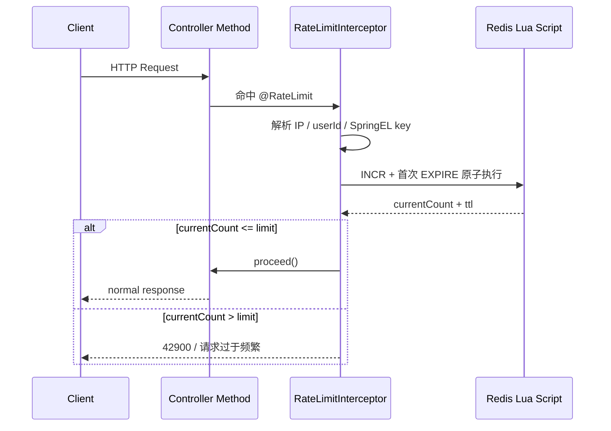

# 自定义限流注解设计文档

## 背景

当前后端已经具备 Spring AOP、Redis、统一异常响应、登录上下文和审计注解能力。新增限流不应该做成散落在 Controller 里的手写判断，而应该沉到通用注解能力里，方便上传、登录、短信、导出等高风险接口复用。

必须先挑战一个常见假设：**“有 Redis + 注解就等于限流可靠”是不成立的。** 限流真正要回答的是：按谁限、按什么窗口限、超限如何反馈、Redis 故障时放行还是拒绝、并发下计数和过期是否原子。

## 目标

- 提供 `@RateLimit` 方法级注解，优先用于 Controller 接口。
- 使用 Redis 做分布式计数，保证多实例部署时限流规则一致。
- 支持 SpringEL 生成业务 key，例如按 `biz`、`userId`、请求参数组合限流。
- 支持常见维度：IP、登录用户、IP 或用户兜底、自定义 SpringEL。
- 返回统一业务异常，前端能明确识别“请求过于频繁”。
- 保持实现轻量，不引入 Sentinel、网关或额外中间件。

## 非目标

- 不做全局网关级限流；该能力只保护进入 Spring MVC 方法的请求。
- 不做高精度平滑限流；MVP 使用固定窗口，接受窗口边界突刺。
- 不做管理端动态配置；规则先由注解决定，后续再接系统配置。
- 不做接口配额账单；这不是计费系统，只是保护性限流。

## 推荐方案

采用 **注解 + AOP + Redis Lua 固定窗口计数**。

流程：



## 注解模型

建议注解放在：

`springboot3_init/src/main/java/com/sakura/boot_init/shared/annotation/RateLimit.java`

字段建议：

| 字段 | 类型 | 默认值 | 说明 |
| --- | --- | --- | --- |
| `prefix` | `String` | 必填 | Redis key 前缀，建议按模块命名 |
| `key` | `String` | `""` | SpringEL 表达式，为空时按维度自动生成 |
| `limit` | `int` | 必填 | 窗口内允许次数 |
| `windowSeconds` | `long` | 必填 | 固定窗口秒数 |
| `dimension` | `RateLimitDimension` | `USER_OR_IP` | 限流维度 |
| `message` | `String` | `请求过于频繁，请稍后再试` | 超限提示 |

维度枚举建议：

| 枚举 | 语义 |
| --- | --- |
| `IP` | 只按客户端 IP 限流 |
| `USER` | 只按登录用户限流；未登录直接按未登录异常处理 |
| `USER_OR_IP` | 已登录按用户，未登录按 IP，适合大部分接口 |
| `CUSTOM` | 完全使用 SpringEL key，调用方必须保证 key 不为空 |

示例：

```java
// 上传图片按登录用户 + biz 限流，避免同一用户短时间刷 OSS 上传。
@RateLimit(
        prefix = "upload:image",
        key = "#biz",
        limit = 20,
        windowSeconds = 60,
        dimension = RateLimitDimension.USER_OR_IP
)
@PostMapping("/image/upload")
public BaseResponse<UploadResult> uploadImage(MultipartFile file, String biz) {
    return ResultUtils.success(fileUploadService.uploadImage(file, biz));
}
```

生成的 Redis key 形态建议：

```text
rate_limit:{prefix}:{dimensionValue}:{spelValue}
```

例如：

```text
rate_limit:upload:image:user:10001:photo_wall
rate_limit:auth:login:ip:127.0.0.1
```

## SpringEL 设计

SpringEL 只负责业务差异部分，不应该承担用户/IP 维度拼接。原因很简单：如果每个接口自己写 `#userId`、`#request.remoteAddr`，限流 key 会很快失控。

推荐能力：

- 支持方法参数名：`#biz`、`#request.userId`。
- 支持参数对象属性：`#query.keyword`。
- 支持静态文本拼接：`'type:' + #type + ':biz:' + #biz`。
- 不建议默认开放任意 Bean 调用，避免表达式过强导致安全和可维护性问题。

如果后续确实要开放 Bean，可以只白名单开放少量只读组件，而不是直接暴露完整 `BeanFactoryResolver`。

## Redis 算法

MVP 使用固定窗口：

- 第一次请求：计数加 1，并设置过期时间。
- 后续请求：计数继续加 1，不刷新过期时间。
- 当前计数大于 `limit` 时拒绝。

不能用普通 `INCR` 后再单独 `EXPIRE` 作为最终实现，因为两条命令之间如果进程异常，key 可能没有 TTL。推荐使用 Lua 保证原子性。

Lua 语义：

```lua
-- KEYS[1] 是限流 key。
-- ARGV[1] 是窗口秒数。
local current = redis.call('incr', KEYS[1])
if current == 1 then
    redis.call('expire', KEYS[1], tonumber(ARGV[1]))
end
local ttl = redis.call('ttl', KEYS[1])
return { current, ttl }
```

## 异常与响应

建议在 `ErrorCode` 增加：

```java
// 42900 用于表达业务限流，而不是系统错误。
TOO_MANY_REQUESTS(42900, "error.too_many_requests", "请求过于频繁，请稍后再试")
```

超限时抛：

```java
// 使用 BusinessException 进入现有统一异常响应链路。
throw new BusinessException(ErrorCode.TOO_MANY_REQUESTS, rateLimit.message());
```

HTTP 状态码当前项目统一用 `BaseResponse.code` 表达业务状态，是否额外返回 HTTP 429 可以后续单独决定。MVP 不建议贸然改变全局异常处理 HTTP 状态，否则前端请求封装可能需要同步调整。

## Redis 故障策略

这是必须提前定的边界。

推荐默认：**fail-open，记录错误后放行**。

理由：

- SakuraAdmin 是后台脚手架，限流是保护能力，不应因为 Redis 短暂异常把所有核心接口打挂。
- 登录、上传这类接口可按需增加 `failClosed = true`，但 MVP 不建议把策略复杂化。

如果业务接口明确不能在 Redis 故障时放行，再增加注解字段：

```java
// Redis 限流判断失败时是否拒绝请求，默认 false 表示降级放行。
boolean failClosed() default false;
```

## 关键拷问

1. 你要限制的是“用户行为”还是“接口总流量”？
   推荐答案：这个注解先解决用户/IP 级保护，不解决全站 QPS。全站 QPS 应放到网关或负载均衡层。

2. SpringEL key 是否越灵活越好？
   推荐答案：不是。SpringEL 只做业务后缀，用户/IP 等通用维度由框架拼接，否则每个接口都会发明一套 key。

3. 固定窗口是否足够？
   推荐答案：MVP 足够，但必须承认窗口边界会有突刺。如果接口很敏感，再升级滑动窗口或令牌桶。

4. Redis 挂了应该放行还是拒绝？
   推荐答案：默认放行，因为限流是保护层，不该成为单点故障；高风险接口再单独选择拒绝。

5. 限流是否要记录审计日志？
   推荐答案：MVP 不写业务审计表，避免高频超限反而打爆数据库。最多打 warn 日志或 Micrometer 指标。

## 推荐落点

| 类型 | 路径 |
| --- | --- |
| 注解 | `shared/annotation/RateLimit.java` |
| 维度枚举 | `shared/enums/RateLimitDimension.java` |
| 切面 | `infrastructure/aop/RateLimitInterceptor.java` |
| SpringEL 解析 | `infrastructure/ratelimit/RateLimitKeyResolver.java` |
| Redis 执行器 | `infrastructure/ratelimit/RedisRateLimiter.java` |
| 返回模型 | `infrastructure/ratelimit/RateLimitResult.java` |
| 错误码 | `shared/common/ErrorCode.java` |
| 国际化 | `messages*.properties` |
| 测试 | `src/test/java/.../infrastructure/ratelimit` |

## 验收标准

- 单实例和多实例都共享 Redis 计数。
- 同一个 key 在窗口内超过限制会返回 `42900`。
- 不同用户、不同 IP、不同 SpringEL key 互不影响。
- Redis key 首次创建时一定带 TTL。
- Redis 异常时按策略放行或拒绝，不能吞掉业务异常。
- 注解参数非法时启动或运行期能快速暴露，不允许静默失效。

